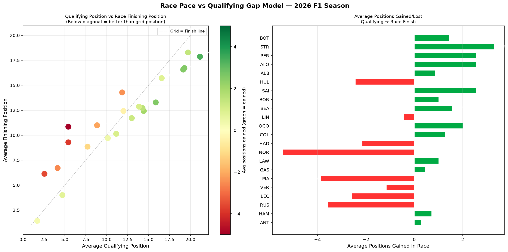

# F1 Race Pace vs Qualifying Gap Model

A Python tool that analyses how Formula 1 drivers' qualifying positions correlate 
with their race finishing positions across the 2026 season, revealing which drivers 
consistently gain or lose positions in races.

## What it does

This script loads race results from every Grand Prix of the 2026 F1 season and 
produces two charts:

- Scatter plot of average qualifying position vs average finishing position, 
  coloured by positions gained — drivers below the diagonal finish better than 
  their grid position
- Horizontal bar chart showing average positions gained or lost per driver 
  across the season

## Races Analysed

Australia, China, Japan, Miami, Canada, Monaco, Spain, Austria (2026)

Note: Bahrain and Saudi Arabia were excluded following their cancellation due 
to the Iran conflict.

## Example Output

This analysis of the 2026 F1 season reveals that Norris and Piastri consistently 
lose positions from qualifying to race finish, suggesting McLaren has strong 
one-lap pace but weaker race pace. Meanwhile Stroll and Sainz consistently gain 
positions, indicating strong race management relative to qualifying performance.

## Tech Stack

- Python
- [FastF1](https://github.com/theOehrly/Fast-F1) — official F1 timing and telemetry data
- Matplotlib — data visualisation
- Pandas — data aggregation across multiple race sessions
- NumPy — numerical calculations

## How to Run

1. Install dependencies: `pip install fastf1 matplotlib pandas numpy`
2. Run the script: `python race_pace_qualifying_gap.py`
3. Chart will display and save as `race_pace_qualifying_gap.png`

## Why This Project

Understanding the gap between qualifying pace and race pace is fundamental to 
race strategy. This model helps identify which drivers and teams have a genuine 
race pace advantage versus one-lap speed — critical information for pit stop 
timing and strategy decisions.

## Author

Hamna Shahzad — Electrical Engineering Student | Aspiring Motorsport Engineer
